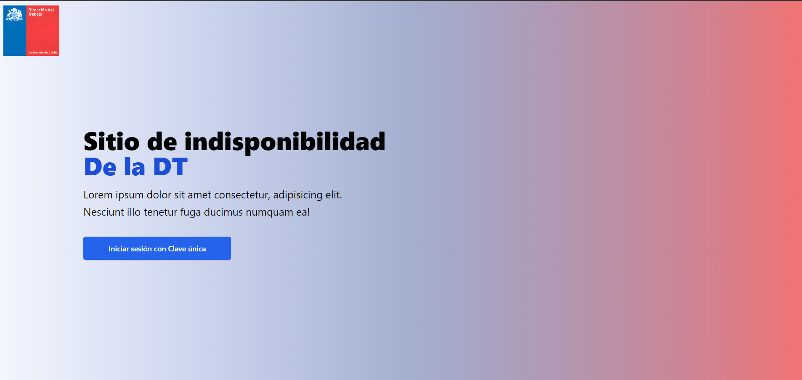
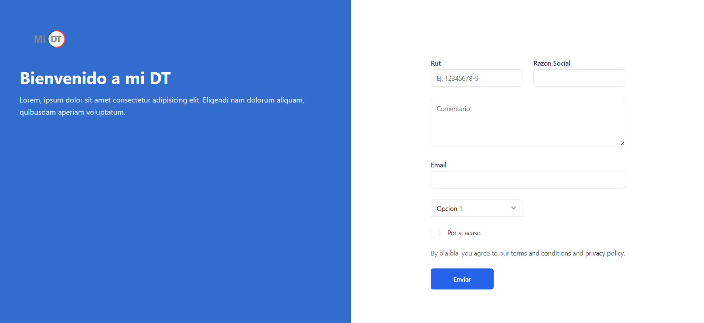

# DtSitiodeindisponibilidad
###  Esto es solo una beta y contiene la maquetación del front end, no contiene datos reales.
Proyecto realizado para la Dirección del Trabajo que consistía en desarrollar un formulario de reemplazo para su sistema principal. El formulario permitía a los usuarios ingresar utilizando su clave única y generaba un archivo PDF con información específica. Para garantizar una arquitectura limpia y eficiente, se implementó Clean Architecture en el front-end con Angular y Tailwind CSS.

:point_right: [Live preview](https://formulario-dt-beta.vercel.app/)

Imagen 1:

Imagen 2:

